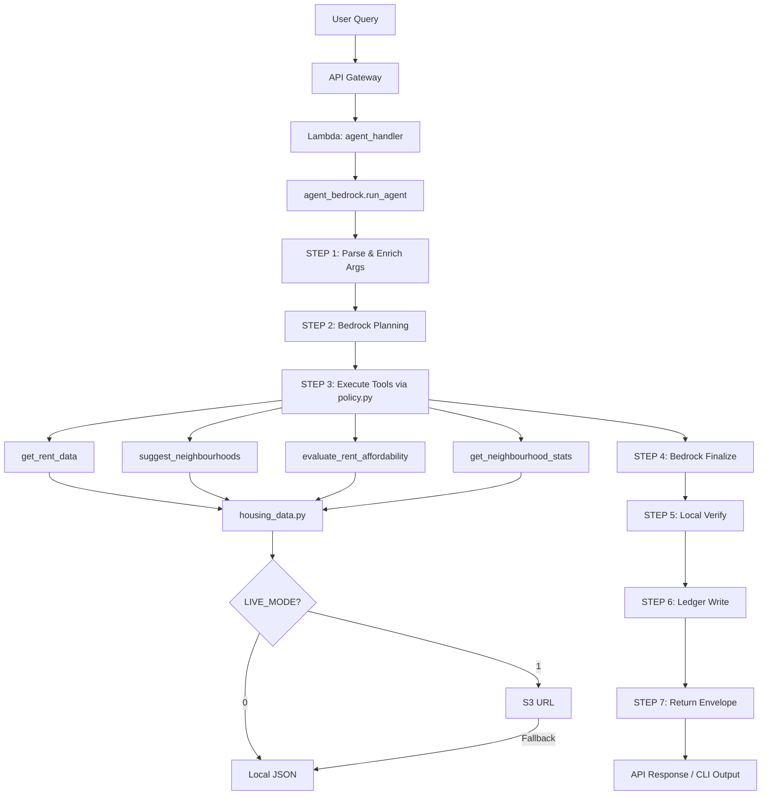

# RentPilot Agent — Architecture

This document describes the end-to-end flow, component responsibilities, and data provenance of the RentPilot agent system.

---

## High-Level Flow

```
┌──────────────┐
│  User Query  │  "Suggest affordable neighbourhoods in Toronto for $80k income"
└──────┬───────┘
       │
       ▼
┌─────────────────────────────────────────────────────────────┐
│  Entry Points                                               │
│  • demo_viewer.html (S3 static UI)                         │
│  • CLI: python agent_bedrock.py "query..."                 │
│  • API: POST /agent                                         │
└──────┬──────────────────────────────────────────────────────┘
       │
       ▼
┌─────────────────────────────────────────────────────────────┐
│  API Gateway (REST API)                                     │
│  • Path: /prod/agent (POST)                                │
│  • CORS: enabled for demo UI                               │
│  • Auth: none (hackathon demo)                             │
└──────┬──────────────────────────────────────────────────────┘
       │
       ▼
┌─────────────────────────────────────────────────────────────┐
│  Lambda: agent_handler.py                                   │
│  • Validates JSON body: {"query": "..."}                   │
│  • Calls agent_bedrock.run_agent(query)                    │
│  • Returns JSON envelope with CORS headers                 │
└──────┬──────────────────────────────────────────────────────┘
       │
       ▼
┌─────────────────────────────────────────────────────────────┐
│  Bedrock Orchestrator: agent_bedrock.py                     │
│                                                             │
│  STEP 1: Parse & Enrich Args                               │
│  ├─ _parse_inline_args("query :: key=value prefs={...}")  │
│  ├─ _auto_args_from_text(city, property_type extraction)   │
│  └─ _normalize_prefs(merge defaults with user prefs)       │
│                                                             │
│  STEP 2: Planning (Bedrock Converse)                       │
│  ├─ System prompt: prompts/planning.txt (or fallback)      │
│  ├─ User payload: {query, args}                            │
│  ├─ Model: Claude 3 Sonnet (anthropic.claude-3-sonnet...)  │
│  └─ Output: {plan: string, actions: [{tool, args}]}        │
│                                                             │
│  STEP 3: Execute Tools (Deterministic)                     │
│  ├─ policy.decide_and_act(query, enriched_args)            │
│  │   ├─ classify_intent(query) → "suggest" | "afford" ...  │
│  │   ├─ fill_defaults(args)                                │
│  │   └─ Call tool Lambda via local import                  │
│  │       ├─ get_rent_data.lambda_handler                   │
│  │       ├─ suggest_neighbourhoods.lambda_handler          │
│  │       ├─ evaluate_rent_affordability.lambda_handler     │
│  │       └─ get_neighbourhood_stats.lambda_handler         │
│  └─ Returns: {statusCode, body: {...}}                     │
│                                                             │
│  STEP 4: Finalize (Bedrock Converse)                       │
│  ├─ System prompt: prompts/finalize.txt (or fallback)      │
│  ├─ User payload: {query, plan, actions, tool_result}      │
│  ├─ Model: Claude 3 Sonnet                                 │
│  └─ Output: {plan, actions, verify, answer: {...}}         │
│                                                             │
│  STEP 5: Verify (Local Checks)                             │
│  ├─ _local_verify(result)                                  │
│  │   ├─ Empty recommendations? → suggest filter hints      │
│  │   ├─ Affordability sanity (listing >> target ratio?)    │
│  │   └─ Returns: {ok: bool, reasons?: []}                  │
│  └─ Overwrites result["verify"]                            │
│                                                             │
│  STEP 6: Ledger (JSONL + optional S3)                      │
│  ├─ write_step(stage="planning", payload={...})            │
│  ├─ write_step(stage="tool_execute", payload={...})        │
│  ├─ write_step(stage="finalize", payload={...})            │
│  └─ write_entry(user_query, args, result, session_id, ...) │
│      ├─ Local: /tmp/ledger.jsonl (Lambda) or out/ (CLI)    │
│      └─ S3: s3://bucket/ledger/{session_id}/{ts}.json      │
│                                                             │
│  STEP 7: Return Envelope                                   │
│  └─ {plan, actions, verify, answer, meta}                  │
└──────┬──────────────────────────────────────────────────────┘
       │
       ▼
┌─────────────────────────────────────────────────────────────┐
│  Response to User                                           │
│  • API: 200 OK + JSON envelope                             │
│  • CLI: Printed blocks (plan, verify, answer) or --json    │
│  • UI: Displays summary + verify status + full JSON        │
└─────────────────────────────────────────────────────────────┘
```

---

## Component Responsibilities

### **1. agent_bedrock.py** (Orchestrator)
**Purpose**: Coordinate Bedrock planning + finalize, deterministic tool execution, verification, and ledger logging.

**Key Functions**:
- `run_agent(user_input, ...)` — main entry point
- `_parse_inline_args(q)` — parse `:: key=value prefs={...}` syntax
- `_auto_args_from_text(text, args)` — extract city, property_type from free text
- `_normalize_prefs(enriched_args)` — merge user prefs with env defaults
- `_converse_plan(model_id, clean_query, enriched_args)` — Bedrock planning
- `_converse_finalize(model_id, clean_query, plan, actions, tool_result)` — Bedrock summary
- `_local_verify(result)` — deterministic verification (empty recs? affordability sanity?)
- `_extract_first_json(text)` — robust JSON extraction from model output

**Inputs**: User query string (supports inline args)

**Outputs**: JSON envelope `{plan, actions, verify, answer, meta}`

---

### **2. policy.py** (Intent Router)
**Purpose**: Classify user intent and route to appropriate Lambda tool.

**Key Functions**:
- `classify_intent(user_text)` → `"explain" | "city_rent" | "neigh_stats" | "affordability" | "suggest"`
- `decide_and_act(user_text, args)` → calls appropriate tool(s), returns `{plan, actions, verify, answer}`

**Tools Mapped**:
- `city_rent` → `get_rent_data.lambda_handler`
- `neigh_stats` → `get_neighbourhood_stats.lambda_handler`
- `affordability` → `evaluate_rent_affordability.lambda_handler`
- `suggest` → `suggest_neighbourhoods.lambda_handler`
- `explain` → local response (no external tool)

---

### **3. Lambda Tools** (Deterministic)

#### **lambdas/get_rent_data.py**
**Purpose**: Fetch city-level median rent (optionally with neighbourhood breakdowns).

**Inputs**:
```json
{
  "city": "Toronto",
  "property_type": "1bed",
  "include_neighbourhoods": true
}
```

**Outputs**:
```json
{
  "city": "Toronto",
  "property_type": "1bed",
  "median": 2300,
  "currency": "CAD/month",
  "neighbourhoods": [{"name": "...", "median": ...}, ...]
}
```

---

#### **lambdas/suggest_neighbourhoods.py**
**Purpose**: Filter and rank neighbourhoods by affordability, transit, distance.

**Inputs**:
```json
{
  "city": "Toronto",
  "property_type": "1bed",
  "income_annual": 80000,
  "prefs": {
    "max_distance_km": 15,
    "min_transit": 65,
    "target_rent_to_income": 0.30
  },
  "budget_cap": null
}
```

**Scoring Formula**:
```python
score = (W_AFF × affordability_component) + (W_TRN × transit_norm) + (W_DST × distance_component)
```
Where:
- `W_AFF=0.5`, `W_TRN=0.3`, `W_DST=0.2` (env vars: `FTA_W_AFFORD`, `FTA_W_TRANSIT`, `FTA_W_DIST`)
- `affordability_component = 1 - (rti - target) / target` (clamped [0,1])
- `transit_norm = transit_score / 100` (0-100 scale)
- `distance_component = 1 - (distance_km / max_distance_km)`

**Outputs**:
```json
{
  "city": "Toronto",
  "property_type": "1bed",
  "recommendations": [
    {
      "name": "Scarborough Junction",
      "median": 1950,
      "rent_diff_vs_listing": -250,
      "rent_to_income": 0.293,
      "transit": 75,
      "distance_km": 8.2,
      "score": 0.87,
      "why": "Cheaper by $250/mo; meets transit ≥65; at or below 30% RTI."
    }
  ]
}
```

---

#### **lambdas/evaluate_rent_affordability.py**
**Purpose**: Assess affordability of a specific listing.

**Inputs**:
```json
{
  "listing_price": 2200,
  "city_median": 2300,
  "income_annual": 80000,
  "target_ratio": 0.30
}
```

**Outputs**:
```json
{
  "verdict": "Affordable — 33% RTI vs 30% target; slightly above ideal.",
  "rti": 0.33,
  "eps": -0.04,  // Equivalent Percentage Savings vs city median
  "delta": 100,  // listing_price - city_median
  "income_monthly": 6666.67
}
```

---

#### **lambdas/get_neighbourhood_stats.py**
**Purpose**: List all neighbourhoods with medians for a city/property_type.

**Outputs**:
```json
{
  "city": "Toronto",
  "property_type": "1bed",
  "neighbourhoods": [
    {"name": "Downtown Core", "median": 2800, "transit": 95, "distance_km": 0.5},
    ...
  ]
}
```

---

### **4. providers/housing_data.py** (Data Access Layer)
**Purpose**: Abstract data source (local JSON vs S3 URL).

**Modes**:
- **LIVE_MODE=0** (default): Read from local `data/Neighbourhood Medians Patching.json`
- **LIVE_MODE=1**: Fetch from S3 URL (`FTA_DATA_URL`), fallback to local on error

**Key Functions**:
- `get_city_obj(city)` → city metadata + neighbourhoods
- `get_city_median(city, prop)` → city-level median rent
- `list_neighbourhoods(city)` → list of neighbourhood dicts
- `get_neighbourhood_median(row, prop)` → neighbourhood-level median
- `get_neighbourhood_transit(row, default=0)` → transit score [0-100]

**Caching**: In-process memo (`_CACHE`) per Lambda invocation.

---

### **5. ledger.py** (Audit Trail)
**Purpose**: Append-only JSONL logging of all interactions + intermediate steps.

**Functions**:
- `write_entry(user_query, args, result, session_id, ...)` → canonical one-line record
- `write_step(user_query, stage, payload, session_id, ...)` → lightweight breadcrumb

**Destinations**:
- **Local**: `out/ledger.jsonl` (CLI) or `/tmp/ledger.jsonl` (Lambda)
- **S3**: `s3://{LEDGER_S3_BUCKET}/{LEDGER_S3_PREFIX}/{session_id}/{ts}.json` (optional)

**Failure Handling**: Never crashes the main flow; best-effort S3 upload.

---

## Data Provenance

### **Source Data**
**CMHC Rental Market Survey (October 2024)**
- Canada Mortgage and Housing Corporation public dataset
- City-level medians: Toronto, Vancouver, Montreal (extensible)
- Property types: studio, 1bed, 2bed, 3bed

### **Neighbourhood-Level Synthesis**
- CMHC publishes zone-level data (not granular neighbourhoods)
- We patch with Toronto Open Data for transit scores
- Data preprocessing: `tools/merge_cmhc.py`, `tools/patch_toronto_aliases.py`

### **JSON Schema** (`data/Neighbourhood Medians Patching.json`):
```json
{
  "meta": {
    "version": "v1.2-cmhc-oct2024",
    "snapshot_month": "2024-10",
    "currency": "CAD/month"
  },
  "cities": {
    "Toronto": {
      "medians": {
        "studio": 1850,
        "1bed": 2300,
        "2bed": 2950,
        "3bed": 3500
      },
      "neighbourhoods": [
        {
          "name": "Downtown Core",
          "median": {"studio": 2100, "1bed": 2800, "2bed": 3600, "3bed": 4200},
          "transit": 95,
          "distance_km": 0.5
        },
        ...
      ]
    },
    "Vancouver": { ... },
    "Montreal": { ... }
  }
}
```

---

## Diagram (Mermaid)



---

## Security Considerations

1. **IAM Scoping**: Bedrock resource scoped to `foundation-model/*` in current region (not wildcard `*`)
2. **No PII Logging**: Queries contain income/property_type but no names/addresses
3. **CORS**: Demo UI uses `*`; production should restrict origins
4. **API Gateway**: No auth for demo; production should use API keys or Cognito

---

## Scalability & Performance

| Metric | Value | Notes |
|--------|-------|-------|
| **Cold Start** | ~1.5s | Bedrock Converse + Lambda init |
| **Warm Latency** | <500ms | Lambda container reuse |
| **Data Cache** | In-process | Per-container (survives warm invokes) |
| **Concurrency** | Default 1000 | Lambda account limit (adjustable) |
| **Cost** | ~$0.026/1K queries | See README cost breakdown |

---

## Extensibility

### Add a New City
1. Update `data/Neighbourhood Medians Patching.json` with new city object
2. Optionally upload to S3 and set `FTA_DATA_URL`
3. No code changes required

### Add a New Tool
1. Create `lambdas/new_tool.lambda_handler(event, context)`
2. Register in `policy.py` and `agent_bedrock.py` planning prompt
3. Update `template.yaml` with new Lambda resource

### Add Bedrock AgentCore Primitive
See [AGENTCORE_NOTES.md](AGENTCORE_NOTES.md) for integration recipe.

---

## UI Features (demo_viewer.html)

The static demo UI includes several judge-friendly features:

| Feature | Description | Benefit |
|---------|-------------|---------|
| **Sample Prompt Buttons** | 4 pre-configured queries (Quick check, Shortlist areas, Explain math, Graceful error) | Judges can test instantly without typing |
| **Copy cURL** | Generates CLI command for current query | Easy CloudWatch log correlation |
| **Overlay Spinner** | Visual feedback during API calls | Professional UX |
| **Collapsible JSON** | Toggle JSON envelope visibility | Cleaner presentation |
| **Enter Key Submit** | Press Enter to run query | Keyboard-friendly |
| **Model Metadata Pill** | Shows `model: anthropic.claude-3-sonnet-...` after first run | Transparency |

**Sample Prompts** (natural language, no `::` syntax):
1. "Could you check the typical 1-bed rent in Toronto and whether $2,200/month makes sense on an $80k salary?"
2. "Help me shortlist a few Toronto neighbourhoods for a 1-bed. Budget is about $2,200/month, within roughly 12 km of downtown, and I'd like decent transit (around 70+)."
3. "Before picking places, explain how you decide if a rent is affordable—for example, is $2,400/month reasonable on an $85k income?"
4. "Try evaluating affordability with just a rent price so I can see your error handling."

---

## Monitoring & Debugging

- **CloudWatch Logs**: Each Lambda function logs to `/aws/lambda/<function-name>`
- **Ledger**: Local JSONL or S3 for full audit trail
- **X-Ray** (optional): Add `Tracing: Active` to `template.yaml` for distributed tracing
- **Metrics**: API Gateway + Lambda metrics in CloudWatch
- **UI cURL Copy**: Use "Copy cURL" button to generate exact CLI command for log correlation
